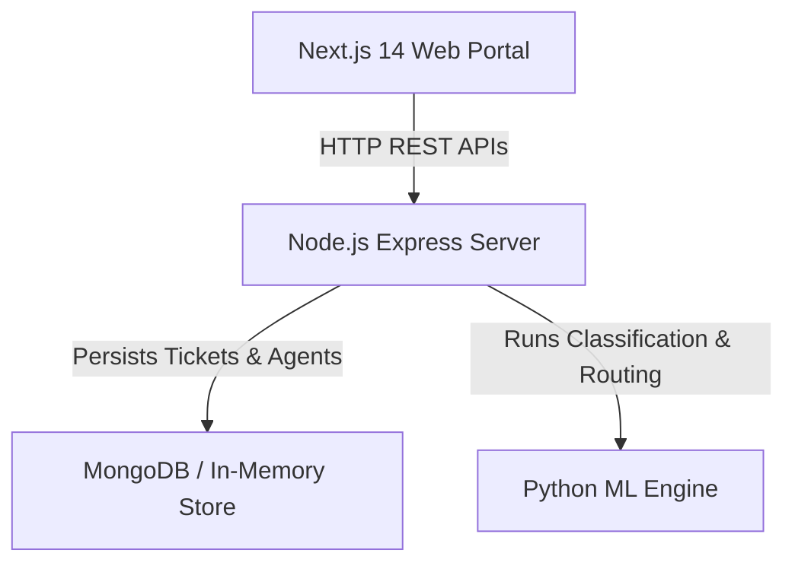

# AI-Based Customer Support Ticketing System

An enterprise-grade, smart customer support platform built with **Next.js**, **Node.js (Express)**, **Python (ML / NLP)**, and **MongoDB**. Features automated ticket classification, AI-driven workload routing, SLA tracking & breach monitoring, agent performance leaderboards, and customer satisfaction analytics.


---

## 🌟 Key Features

### 1. 🤖 AI-Powered Ticket Classification & Automated Routing
- **NLP Text Classification**: Predicts ticket category (`Billing & Payments`, `Technical & Bugs`, `Account & Security`, `Feature Requests`, `General Inquiries`).
- **Urgency & Priority Scoring**: Assigns `Urgent`, `High`, `Medium`, or `Low` priority with automatic SLA deadlines.
- **Sentiment Engine**: Analyzes customer tone (`Positive`, `Neutral`, `Negative`, `Frustrated`) and calculates sentiment scores.
- **Smart Agent Matcher**: Routes tickets based on domain specialty alignment, current queue load, and agent rating.

### 2. ⏱️ SLA Tracking & Breach Prevention
- **Dynamic SLA Timers**: Urgent (1 hour), High (4 hours), Medium (12 hours), Low (24 hours).
- **Compliance Rate Gauges**: Live SLA target monitoring (% met vs breached).
- **Early Warning Triggers**: Highlights tickets approaching breach window within 60 minutes.

### 3. 👥 Agent Performance Dashboards
- **Workload Balancer**: Real-time capacity meters for active vs maximum agent queue limits.
- **Key Metrics**: Average Handle Time (AHT), total tickets resolved, and customer ratings.
- **Agent Status Control**: Availability toggles for optimal team routing.

### 4. ⭐ Customer Satisfaction (CSAT) Analytics
- **CSAT Gauge & Net Promoter Score (NPS)**: Real-time score aggregation.
- **Sentiment Breakdown**: Distribution of customer sentiment across support streams.
- **Feedback Feed**: Customer ratings and qualitative feedback logs.

---

## 🏗️ Architecture & Tech Stack



- **Frontend**: Next.js 14, React 18, Glassmorphism CSS design system.
- **Backend**: Node.js, Express, REST API.
- **Machine Learning**: Python, Scikit-Learn, TF-IDF Vectorization, NLP Sentiment Lexicon.
- **Database**: MongoDB Mongoose connection + Native zero-dependency fallback store.

---

## 🚀 Quick Start Guide

### 1. Run Backend REST API Server (Port 5000)
```bash
cd backend
node src/server.js
```
The server will start at `http://localhost:5000`.

### 2. Run Python ML Classification Service
```bash
cd ml_service
python classifier.py
```

### 3. Run Next.js Web Frontend
```bash
cd frontend
npm install
npm run dev
```
Open `http://localhost:3000` in your browser.

---

## 📌 API Reference

| Method | Endpoint | Description |
| :--- | :--- | :--- |
| `GET` | `/api/tickets` | List all support tickets with filtering |
| `POST` | `/api/tickets` | Submit new ticket with automated AI classification & routing |
| `POST` | `/api/ai/classify` | Live AI preview endpoint for subject & description |
| `PUT` | `/api/tickets/:id` | Update ticket status / reassign agent |
| `GET` | `/api/sla/metrics` | Retrieve SLA compliance metrics and breach counts |
| `GET` | `/api/agents` | Retrieve agent list & performance stats |
| `GET` | `/api/analytics/csat` | Retrieve CSAT analytics and feedback logs |

---

## 📄 License
MIT License. Built for internship submission.
