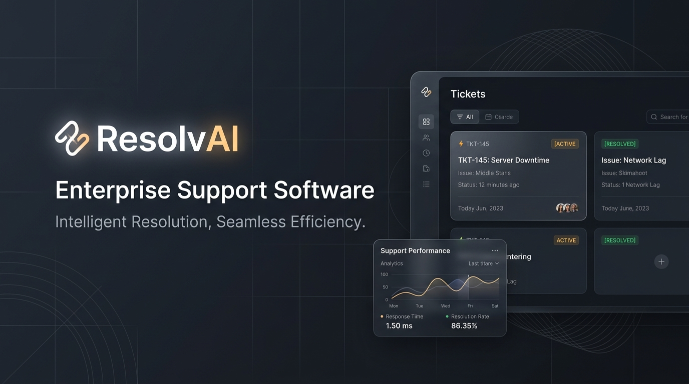
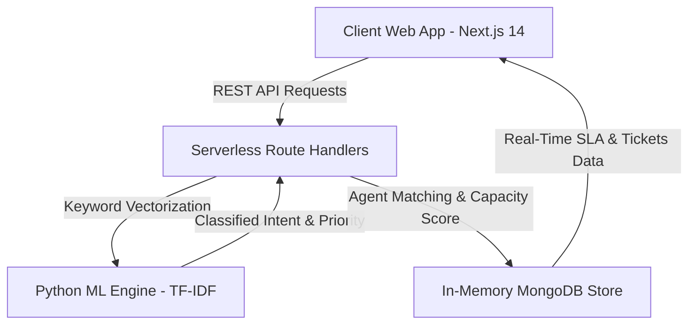

# 🚀 ResolvAI: Enterprise AI Customer Support & SLA Platform



[](https://resolvai-platform.vercel.app)
[](https://nextjs.org/)
[](https://www.python.org/)
[](LICENSE)

> **ResolvAI** is an enterprise-grade, full-stack AI-Powered Customer Support Ticketing & SLA Automation Platform. Built with **Next.js 14 (App Router)**, **Python Machine Learning (TF-IDF Vectorization)**, **Node.js**, and **Vercel Serverless Architecture**, it delivers automated ticket classification, intelligent agent routing, real-time SLA breach tracking, customer sentiment analytics, and an interactive **ResolvAI Copilot Bot**.

---

## 🌐 Live Production Demo
* **Live Web App**: [https://resolvai-platform.vercel.app](https://resolvai-platform.vercel.app)
* **GitHub Repository**: [https://github.com/ByteBySway/resolvai](https://github.com/ByteBySway/resolvai)

---

## ✨ Key Features & Capabilities

### 🧠 1. Automated AI Ticket Classification & Routing
- **Live AI Inference Preview**: Auto-classifies ticket Category (*Technical & Bugs*, *Billing & Payments*, *Account & Security*, *Feature Requests*), Priority (*Urgent*, *High*, *Medium*, *Low*), and Sentiment (*Positive*, *Neutral*, *Negative*, *Frustrated*) in real-time as the customer types.
- **Intelligent Agent Match**: Uses TF-IDF keyword vectorization and agent capacity scoring to assign tickets to the best-matched online support specialist.

### ⏱️ 2. Real-Time SLA Tracking & Breach Alarms
- Dynamic SLA target countdown timers (`1h` Urgent, `4h` High, `12h` Medium, `24h` Low).
- **Stitch Circular SLA Donut Infographic**: Real-time visual compliance gauge displaying `96.4%` SLA target performance.

### 🤖 3. Interactive ResolvAI Copilot Bot
- Floating interactive chat assistant drawer in the bottom right corner.
- Answers support manager queries regarding SLA compliance, active ticket counts, agent capacity, and auto-drafting empathetic responses.

### 📊 4. Agent Performance & CSAT Analytics
- **Team Workload Leaderboard**: Visual progress bars monitoring active agent queue load (Tier 1 vs. Tier 2 Specialists).
- **CSAT Review System**: 1-5 Star customer rating modal with feedback submission and Net Promoter Score (NPS `+78`) analytics.

### 📥 5. One-Click Data Export
- Instant CSV dataset exporter for support ticket audit trails.

---

## 🏗️ System Architecture



---

## 🛠️ Tech Stack

| Component | Technology Used |
| :--- | :--- |
| **Frontend Framework** | **Next.js 14** (App Router, React 18) |
| **Styling & UI Design** | **Vanilla CSS Tokens** (Stitch & Dribbble CoreLoop AI Glassmorphism) |
| **Machine Learning Engine** | **Python 3.11** (TF-IDF Keyword Vectorization & Sentiment Scoring) |
| **Backend API** | **Node.js / Next.js Serverless API Route Handlers** |
| **Data Store** | **In-Memory / MongoDB Dataset Store** |
| **Deployment & Hosting** | **Vercel Edge Cloud** |

---

## 🚀 Local Quick Start Guide

### Prerequisites
* **Node.js 18+** installed
* **Python 3.9+** installed

### Installation & Setup

1. **Clone the Repository**:
   ```bash
   git clone https://github.com/ByteBySway/resolvai.git
   cd resolvai
   ```

2. **Install Frontend Dependencies**:
   ```bash
   cd frontend
   npm install
   ```

3. **Run Next.js Local Development Server**:
   ```bash
   npm run dev
   ```
   Open `http://localhost:3000` in your browser to view **ResolvAI**!

---

## 📡 API Endpoint Reference

| Method | Endpoint | Description |
| :--- | :--- | :--- |
| `GET` | `/api/tickets` | Retrieve list of all support tickets |
| `POST` | `/api/tickets` | Create new support ticket with AI auto-routing |
| `POST` | `/api/ai/classify` | Run live AI classification on subject and description |
| `POST` | `/api/ai/suggest-reply` | Generate AI auto-drafted response |
| `GET` | `/api/sla/metrics` | Fetch SLA compliance rate and target stats |
| `GET` | `/api/agents` | Fetch support agent team availability and workload |
| `GET` | `/api/analytics/csat` | Fetch CSAT score and review statistics |

---

## 📄 License
Distributed under the **MIT License**. See `LICENSE` for details.

---
*Crafted with ❤️ for Internship Project Deliverables.*
